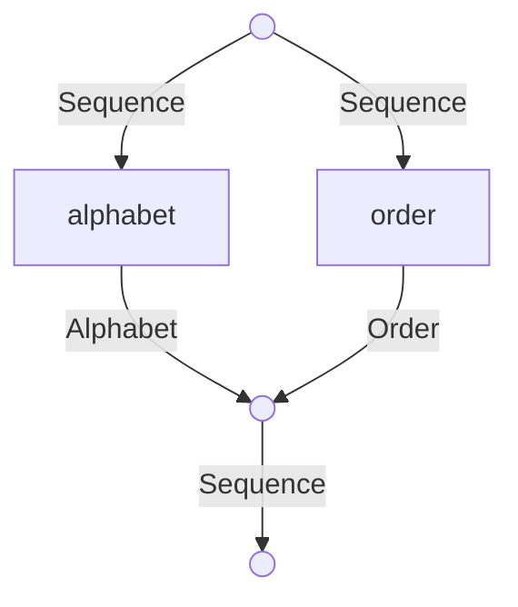
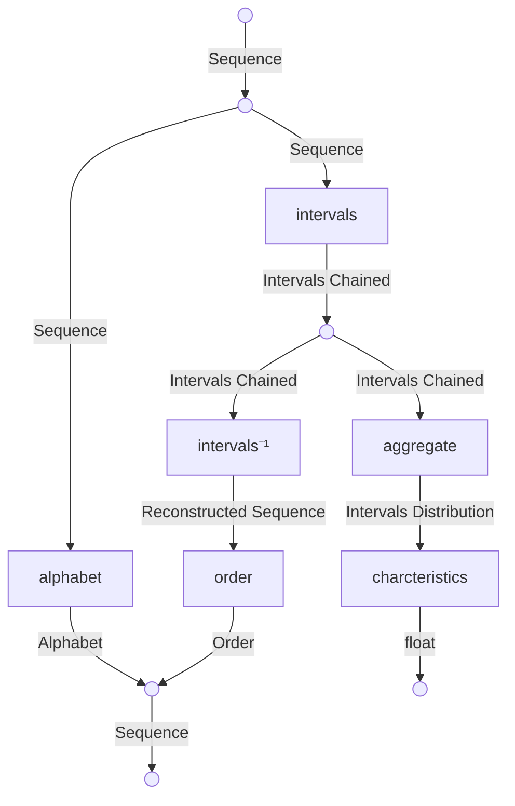

# Objects

```mermaid
flowchart TB
    Start@{ shape: sm-circ, label: "" }-- Sequence -->alphabet
    alphabet-- Alphabet -->OA@{ shape: cross-circ, label: "order + alphabet" }
    Start-- Sequence -->O@{label: "order"}
    O@{label: "order"}-- Order -->OA@{ shape: sm-circ, label: "order + alphabet" }
    OA@{ label: "order + alphabet" }-- Sequence -->End@{ shape: sm-circ, label: "end" }
```

```mermaid
flowchart TB
    Start@{ shape: sm-circ, label: "" }-- Sequence -->fork1@{ shape: sm-circ, label: "" }
    fork1@{ shape: sm-circ, label: "" }-- Sequence -->alphabet
    alphabet-- Alphabet -->OA@{ shape: cross-circ, label: "order + alphabet" }
    O@{label: "order"}-- Order -->OA@{ shape: sm-circ, label: "order + alphabet" }
    OA@{ label: "order + alphabet" }-- Sequence -->End@{ shape: sm-circ, label: "end" }

    fork1@{ shape: sm-circ, label: "" }-- Sequence -->intervals
    intervals-- Intervals Chained -->fork@{ shape: sm-circ, label: "" }
    fork@{ shape: sm-circ, label: "" }-- Intervals Chained -->inverseIntervals@{ label: "intervals⁻¹" }
    fork@{ shape: sm-circ, label: "" }-- Intervals Chained -->aggregate
    inverseIntervals@{ label: "intervals⁻¹" }-- Reconstructed Sequence --> O@{label: "order"}
    aggregate-- Intervals Distribution --> measures@{ label: "charcteristics" }
    measures@{ label: "charcteristics" } -- float --> EndMeaure@{ shape: sm-circ, label: "end" }

```
