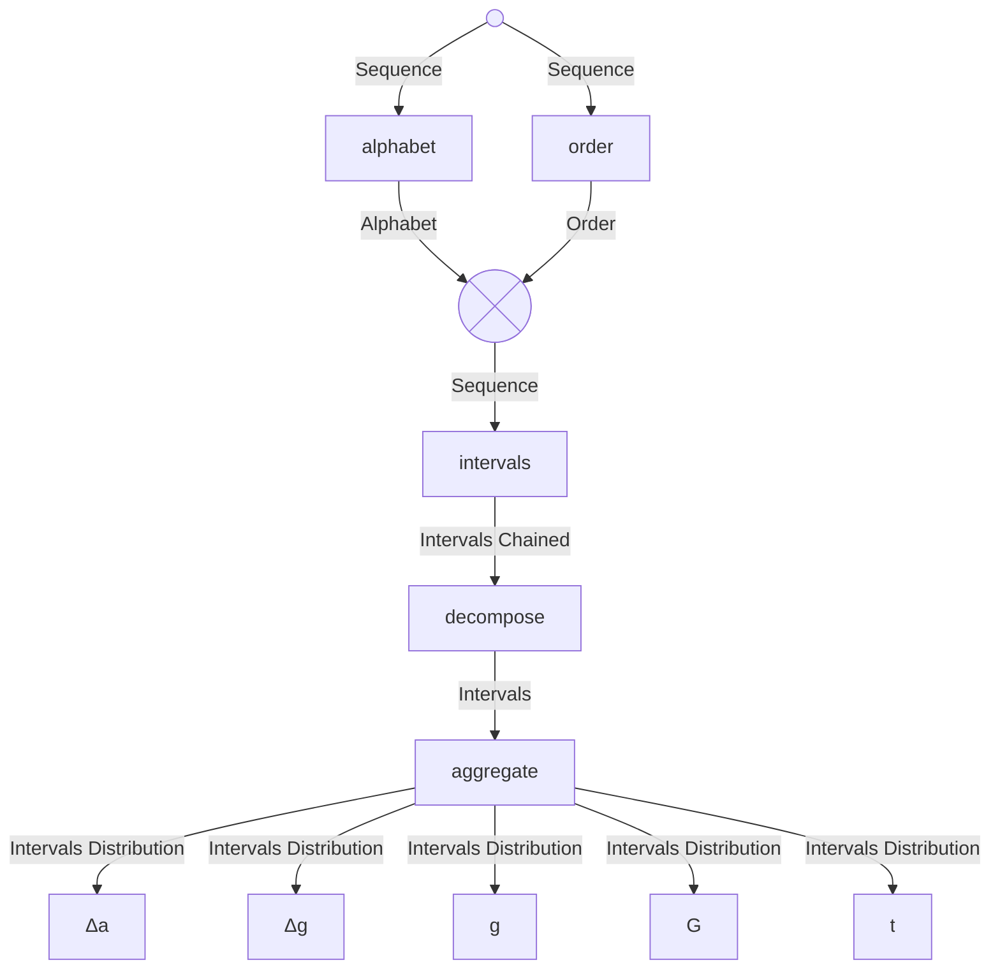
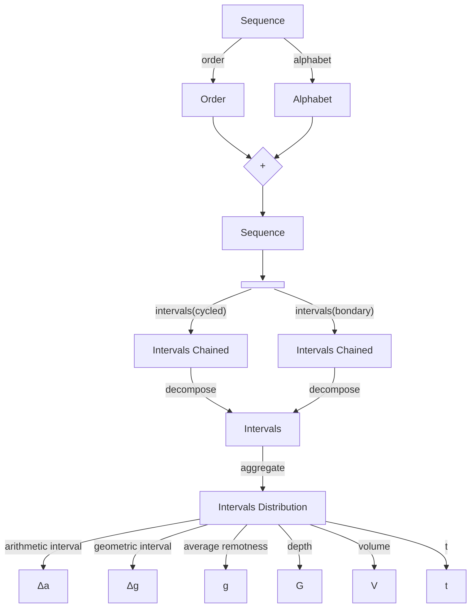

# Objects

```mermaid
flowchart TB
    Start@{ shape: sm-circ, label: "" }-- Sequence -->alphabet
    alphabet-- Alphabet -->OA@{ shape: cross-circ, label: "order + alphabet" }
    Start-- Sequence -->O@{label: "order"}
    O@{label: "order"}-- Order -->OA@{ shape: cross-circ, label: "order + alphabet" }
    OA@{ label: "order + alphabet" }-- Sequence -->intervals
    intervals-- Intervals Chained -->decompose
    decompose-- Intervals -->aggregate
    aggregate-- Intervals Distribution --> da@{ label: "Δa" }
    aggregate-- Intervals Distribution --> dg@{ label: "Δg" }
    aggregate-- Intervals Distribution --> g@{ label: "g" }
    aggregate-- Intervals Distribution --> G@{ label: "G" }
    aggregate-- Intervals Distribution --> t@{ label: "t" }

```

```mermaid
flowchart TB
    Sequence-- alphabet -->Alphabet
    Sequence-- order -->Order
    Order-->OA@{ shape: diamond, label: "+" }
    Alphabet-->OA@{ shape: diamond, label: "+" }
    OA@{ shape: diamond, label: "\\+" }-->Sequencetwo@{ label: "Sequence" }
    Sequencetwo@{ label: "Sequence" }-->fork@{ shape: fork, label: "" }
    fork@{ shape: fork, label: "" }-- intervals(cycled) --> ICC@{ label: "Intervals Chained" }
    fork@{ shape: fork, label: "" }-- intervals(bondary) --> ICB@{ label: "Intervals Chained" }
    ICC@{ label: "Intervals Chained" }-- decompose -->IT@{ label: "Intervals" }
    ICB@{ label: "Intervals Chained" }-- decompose -->IT@{ label: "Intervals" }
    IT@{ label: "Intervals" }-- aggregate -->ID@{ label: "Intervals Distribution" }
    ID@{ label: "Intervals Distribution" }-- arithmetic interval -->da@{ label: "Δa" }
    ID@{ label: "Intervals Distribution" }-- geometric interval -->dg@{ label: "Δg" }
    ID@{ label: "Intervals Distribution" }-- average remotness -->g@{ label: "g" }
    ID@{ label: "Intervals Distribution" }-- depth -->G@{ label: "G" }
    ID@{ label: "Intervals Distribution" }-- volume -->V@{ label: "V" }
    ID@{ label: "Intervals Distribution" }-- t -->t@{ label: "t" }
```
